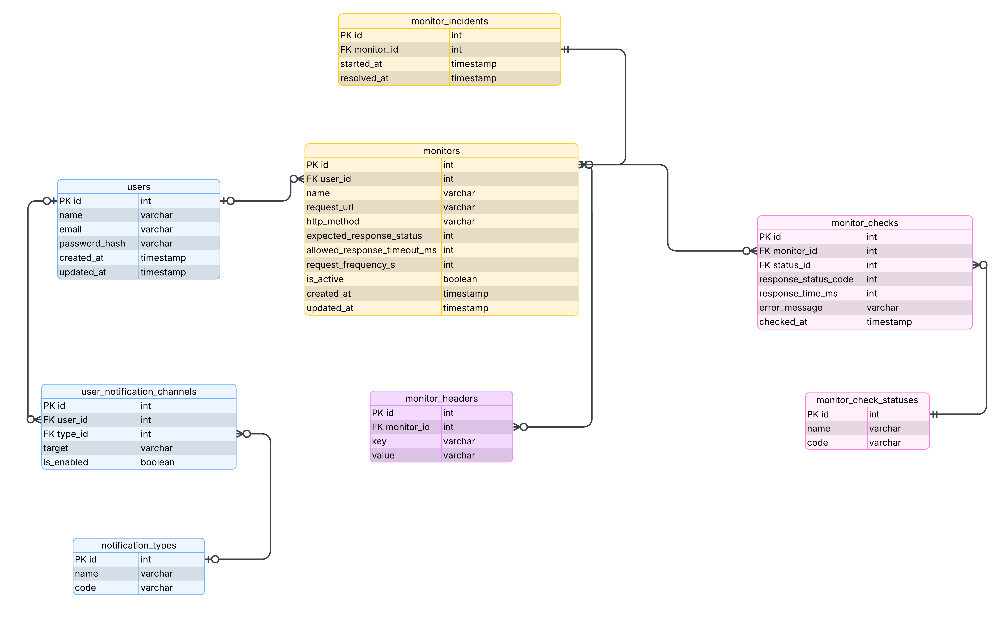

# Web Monitor

Web Monitor is a web monitoring service for tracking website availability, response times, and uptime history.

The application periodically checks configured websites, stores monitoring results, and displays status information in a dashboard.

## Features

- Website uptime monitoring
- Response time tracking
- Periodic automated checks
- Monitoring history
- Status dashboard
- CI/CD pipeline with GitHub Actions
- Automated linting and build validation

## Tech Stack

### Frontend

- React
- Vite
- TypeScript

### Backend

- Node.js
- Express
- TypeScript

### Database

- PostgreSQL

## Database schema



### Planned Infrastructure

- GitHub Actions
- Docker
- Vercel
- Render
- Playwright
- Vitest
- Supertest
- Sentry

## Development Plan

### Phase 1: Project Setup

- [x] Initialize repository
- [x] Setup frontend and backend
- [x] Configure GitHub Actions CI
- [x] Configure lint/build checks
- [x] Setup prettier
- [x] Configure branch protection rules

### Phase 2: Core Monitoring Logic

- [ ] Create monitor model
- [ ] Add monitor creation API
- [ ] Validate URLs
- [ ] Implement periodic checks
- [ ] Save response status and latency
- [ ] Create frontend monitor list

### Phase 3: Database

- [ ] Setup PostgreSQL
- [ ] Add database layer
- [ ] Store monitor history
- [ ] Add migrations
- [ ] Configure test database

### Phase 4: Testing

- [ ] Add backend unit tests
- [ ] Add integration tests
- [ ] Add frontend tests
- [ ] Add Playwright e2e tests
- [ ] Run tests in CI

### Phase 5: Deployment

- [ ] Deploy frontend
- [ ] Deploy backend
- [ ] Configure environment variables
- [ ] Add preview deployments
- [ ] Add production health checks

### Phase 6: Monitoring & Observability

- [ ] Add logs
- [ ] Add uptime monitoring
- [ ] Add Sentry
- [ ] Add metrics dashboard
- [ ] Monitor the monitor itself

## CI/CD Workflow

```text
feature branch
→ commit
→ push
→ pull request
→ GitHub Actions
→ checks
→ merge
→ deployment
```
